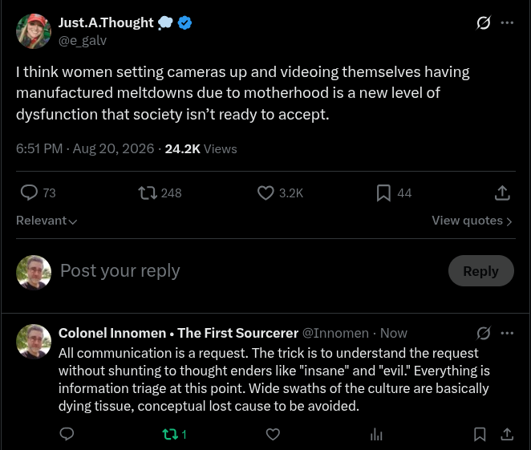

# Public Take transcript

## Machine transcription

&4 Just.AThought @ & A -

e galv

I think women setting cameras up and videoing themselves having
manufactured meltdowns due to motherhood is a new level of

dysfunction that society isn’t ready to accept.

6:51 PM - Aug 20, 2026 - 24.2K Views

Qn 1248 Q 3.2k [ngp s

Relevanty View quotes >

. Post your reply

. Colonel Innomen « The First Sourcerer @Innomen - Now [
All communication is a request. The trick is to understand the request

without shunting to thought enders like "insane” and "evil Everything is
information triage at this point. Wide swaths of the culture are basically
dying tissue, conceptual lost cause to be avoided.

Qo =3 v ihi na
