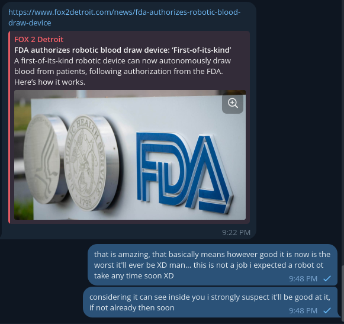

# Public Take transcript

## Machine transcription

hitps://www.fox2detroit.com/news/fda-authorizes-robotic-blood-
draw-device

FOX 2 Detroit

FDA authorizes robotic blood draw device: First-of-its-kind"
Afirst-of-its-kind robotic device can now autonomously draw
blood from patients, following authorization from the FDA.
Here's how it works,

thatis amazing, that basically means however good it is now is the
worst itl ever be XD man... this is not a job i expected a robot ot
take any time soon XD 9:48PM v

considering it can see inside you i strongly suspect itll be good at it,
if not already then soon 9:48PM v
