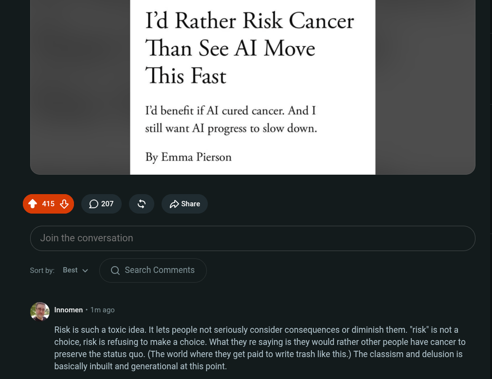

# Public Take transcript

## Machine transcription

I'd Rather Risk Cancer
Than See AI Move
This Fast

I'd benefit if AT cured cancer. And I

still want AI progress to slow down.

By Emma Pierson

ortby: Best v Q Search Comments

E Innomen - 1m ago

Risk is such a toxic idea. It lets people not seriously consider consequences or diminish them. "risk" is not a
choice, risk is refusing to make a choice. What they re saying is they would rather other people have cancer to
preserve the status quo. (The world where they get paid to write trash like this.) The classism and delusion is
basically inbuilt and generational at this point.
