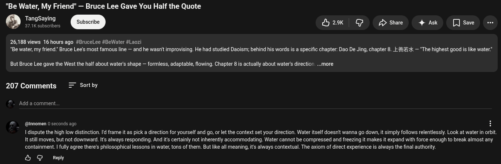

# Public Take transcript

## Machine transcription

"Be Water, My Friend" — Bruce Lee Gave You Half the Quote

TangSaying
@ 37.1K subscribers = ok G £> Share 4 Ask [ save

26,188 views 16 hours ago #BruceLee #BeWater #Laozi

"Be water, my friend Bruce Lee's most famous line — and he wasnit improvising. He had studied Daoism; behind his words is a specific chapter: Dao De Jing, chapter 8. _E#57k — "The highest good is like water”

But Bruce Lee gave the West the half about water's shape — formless, adaptable, flowing. Chapter 8is actually about water's direction ...more

207 Comments = Sortby

Add a comment.

@innomen 0 seconds ago

I dispute the high low distinction. Id frame it as pick  direction for yourself and go, or let the context set your direction. Water itself doesnit wanna go down, it simply follows relentlessly. Look at water in orbit,
It still moves, but not downward. It always responding. And it certainly not inherently accommodating. Water cannot be compressed and freezing it makes it expand with force enough to break almost any
containment.  fully agree there's philosophical lessons in water, tons of them. But like all meaning, it always contextual. The axiom of direct experience is always the final authority.

O @ Reply
