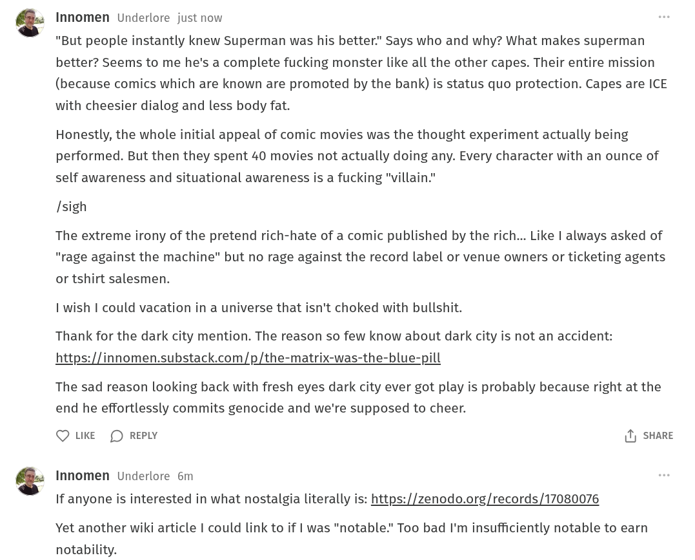

# Public Take transcript

## Machine transcription

Innomen Underlore just now

"But people instantly knew Superman was his better"" Says who and why? What makes superman
better? Seems to me he's a complete fucking monster like all the other capes. Their entire mission
(because comics which are known are promoted by the bank) is status quo protection. Capes are ICE
with cheesier dialog and less body fat.

Honestly, the whole initial appeal of comic movies was the thought experiment actually being
performed. But then they spent 40 movies not actually doing any. Every character with an ounce of
self awareness and situational awareness is a fucking "villain."

[sigh

The extreme irony of the pretend rich-hate of a comic published by the rich... Like | always asked of
"rage against the machine" but no rage against the record label or venue owners or ticketing agents
or tshirt salesmen.

I wish I could vacation in a universe that isn't choked with bullshit.

Thank for the dark city mention. The reason so few know about dark city is not an accident:
https://innomen.substack.com/p/the-matrix-was-the-blue-pill

The sad reason looking back with fresh eyes dark city ever got play is probably because right at the
end he effortlessly commits genocide and we're supposed to cheer.

Q LKE (D REPLY 1) SHARE

Innomen Underlore 6m

If anyone is interested in what nostalgia literally is: https://zenodo.org/records /17080076

Yet another wiki article | could link to if | was "notable." Too bad I'm insufficiently notable to earn
notability.
