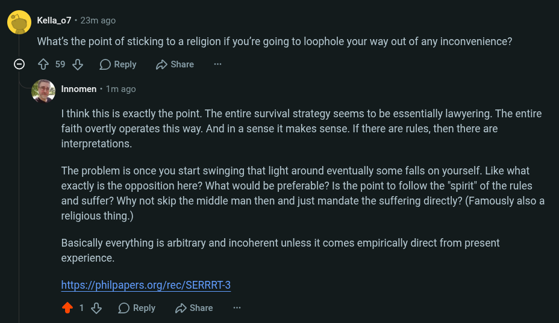

# Public Take transcript

## Machine transcription

. Kella_o7 - 23m ago

What's the point of sticking to a religion if you're going to loophole your way out of any inconvenience?

© 5% ORepy 2 shae

. Innomen - 1m ago

I think this is exactly the point. The entire survival strategy seems to be essentially lawyering. The entire
faith overtly operates this way. And in a sense it makes sense. If there are rules, then there are
interpretations.

The problem is once you start swinging that light around eventually some falls on yourself. Like what
exactly is the opposition here? What would be preferable? Is the point to follow the "spirit" of the rules
and suffer? Why not skip the middle man then and just mandate the suffering directly? (Famously also a
religious thing.)

Basically everything is arbitrary and incoherent unless it comes empirically direct from present
experience.

https://philpapers.org/rec/SERRRT-3
4138 OReply 2 Share
