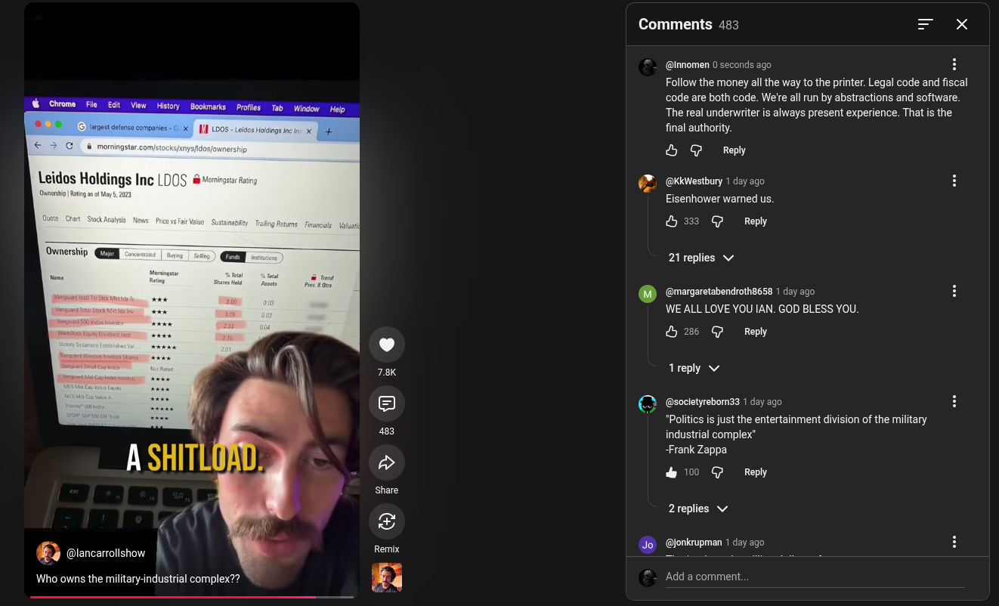

# Public Take transcript

## Machine transcription

Leidos Holdings Inc [DOS #

Ownership QN

Who owns the military-industrial complex??

Comments 483

(@Innomen 0 seconds ago H
Follow the money all the way to the printer. Legal code and fiscal
code are both code. We're all un by abstractions and software.
The real underwriter is always present experience. That is the
final authority,

& G Reply

i)

@KkWestbury 1 day ago
Eisenhower warned us.

& @ Repy

21 replies v/

. (@margaretabendroth8658 1 day ago
WE ALL LOVE YOU IAN. GOD BLESS YOU

&2 @ Repy

1reply v

@socletyrebom33 1 day ago

just the entertainment division of the military
industrial complex”
Frank Zappa

&0 @ Reply

2replies v

. (@jonkrupman 1 day ago

Add a comment.
