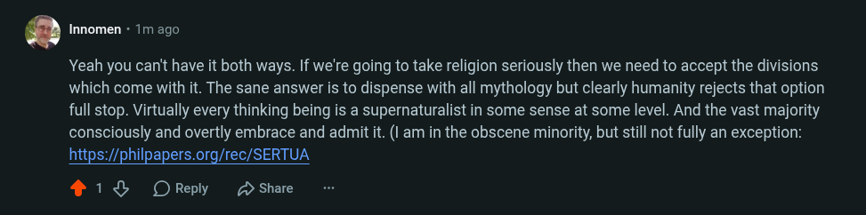

# Public Take transcript

## Machine transcription

. Innomen - 1m ago

Yeah you can't have it both ways. If we're going to take religion seriously then we need to accept the divisions
which come with it. The sane answer is to dispense with all mythology but clearly humanity rejects that option
full stop. Virtually every thinking being is a supernaturalist in some sense at some level. And the vast majority
consciously and overtly embrace and admit it. (I am in the obscene minority, but still not fully an exception:
https://philpapers.org/rec/SERTUA

4138 OReply 2 Share
