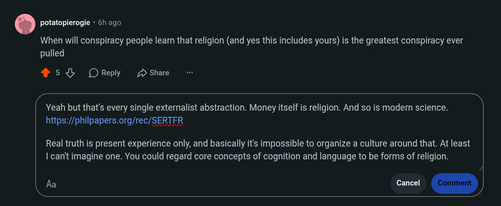

# Public Take transcript

## Machine transcription

. potatopierogie - 6 ago

When will conspiracy people leamn that religion (and yes this includes yours) is the greatest conspiracy ever
pulled

453 OReply D Share

p
Yeah but that's every single externalist abstraction. Money itself is religion. And so is modem science.

https://philpapers.org/rec/SERTFR

J

Real truth is present experience only, and basically it's impossible to organize a culture around that. At least
| can't imagine one. You could regard core concepts of cognition and language to be forms of religion.
