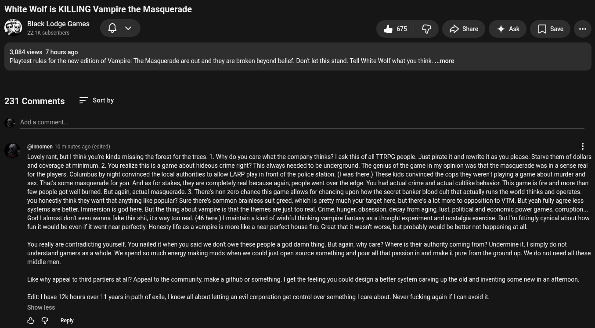

# Public Take transcript

## Machine transcription

White Wolf is KILLING Vampire the Masquerade

Black Lodge Games
221K subscribers Qv

s G /> Share 4 Ask [Jsave -

3,084 views 7 hours ago
Playtest rules for the new edition of Vampire: The Masquerade are out and they are broken beyond belief. Don't let this stand. Tell White Wolf what you think. ..more

231 Comments Sort by

Add a comment.

@nnomen 10 minutes ago (edited)

Lovely rant, but | think you're kinda missing the forest for the trees. 1. Why do you care what the company thinks? | ask this of all TTRPG people. Just pirate it and rewrite it as you please. Starve them of dollars.
and coverage at minimum. 2. You realize this is a game about hideous crime right? This always needed to be underground. The genius of the game in my opinion was that the masquerade was in a sense real
for the players. Columbus by night convinced the local authrities to allow LARP play in front of the police station. (I was there.) These kids convinced the cops they werenit playing a game about murder and
sex. That's some masquerade for you. And as for stakes, they are completely real because again, people went over the edge. You had actual crime and actual cultike behavior. This game is fire and more than
few people got well burned. But again, actual masquerade. 3. There's non zero chance this game allows for chancing upon how the secret banker blood cult that actually runs the world thinks and operates.
you honestly think they want that anything like popular? Sure there's common brainless suit greed, which is pretty much your target here, but there's a lot more to opposition to VTM. But yeah fully agree less
systems are better. Immersion s god here. But the thing about vampire i that the themes are just too real. Crime, hunger, obsession, decay from aging, lust, political and economic power games, corruption...
God | almost don't even wanna fake this shit, it's way too real. (46 here.) | maintain a kind of wishful thinking vampire fantasy as a thought experiment and nostalgia exercise. But I'm fittingly cynical about how
fun it would be even if it went near perfectly. Honesty lfe s a vampire is more like a near perfect house fire. Great that it wasnit worse, but probably would be better not happening at all.

You really are contradicting yourself. You nailed it when you said we donit owe these people a god damn thing. But again, why care? Where is their authority coming from? Undermine it | simply do not

understand gamers as a whole. We spend so much energy making mods when we could just open source something and pour all that passion in and make it pure from the ground up. We do not need all these
middle men

Like why appeal to third partiers at all? Appeal to the community, make a github or something.  get the feeling you could design a better system carving up the old and inventing some new in an afternoon.

Edit: | have 12k hours over 11 years in path of exile, | know all about letting an evil corporation get control over something | care about. Never fucking againif | can avoid it
Show less

O @ Reply
