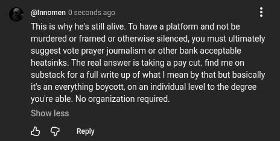

# Public Take transcript

## Machine transcription

@innomen 0 seconds ago

This is why he's stilalive. To have a platform and not be
murdered or framed o otherwise silenced, you must ultimately
suggest vote prayer journalism or other bank acceptable
heatsinks. The real answer is taking a pay cut. find me on
substack for a full write up of what | mean by that but basically
it's an everything boycott, on an individual level to the degree
you're able. No organization required.

Show less.

L @ Reply
