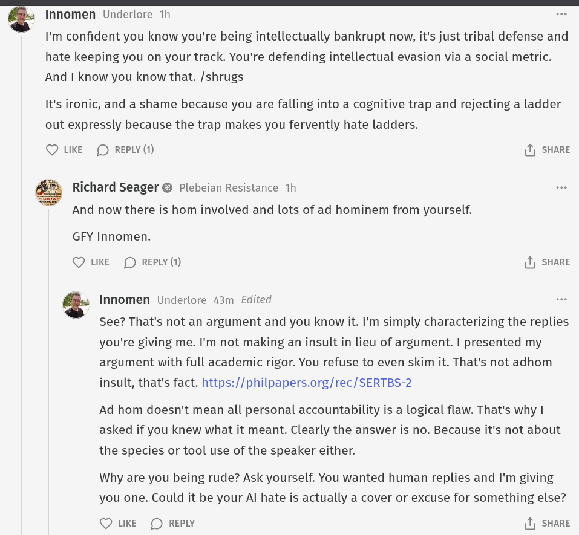

# Public Take transcript

## Machine transcription

Innomen Underlore 1h
I'm confident you know you're being intellectually bankrupt now, it's just tribal defense and
hate keeping you on your track. You're defending intellectual evasion via a social metric.
And | know you know that. /shrugs

It's ironic, and a shame because you are falling into a cognitive trap and rejecting a ladder
out expressly because the trap makes you fervently hate ladders.

Q LIKE (D REPLY (1) (1) SHARE

% Richard Seager @ Plebeian Resistance 1h
And now there is hom involved and lots of ad hominem from yourself.
GFY Innomen.

Q LKE (D REPLY (1) (1) SHARE

* Innomen Underlore 43m Edited
See? That's not an argument and you know it. I'm simply characterizing the replies
you're giving me. I'm not making an insult in lieu of argument. | presented my
argument with full academic rigor. You refuse to even skim it. That's not adhom
insult, that's fact. https://philpapers.org/rec/SERTBS-2

Ad hom doesn't mean all personal accountability is a logical flaw. That's why |
asked if you knew what it meant. Clearly the answer is no. Because it's not about
the species or tool use of the speaker either.

Why are you being rude? Ask yourself. You wanted human replies and I'm giving
you one. Could it be your Al hate is actually a cover or excuse for something else?

Q UKE (D REPLY 1) SHARE
