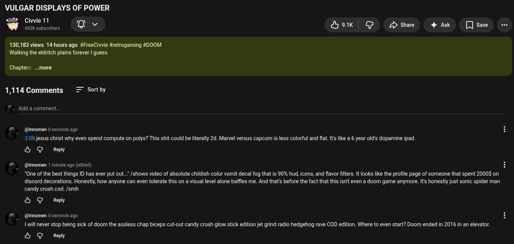

# Public Take transcript

## Machine transcription

VULGAR DISPLAYS OF POWER
% Chavielll o v Dok G Ashae 4 Ak []sae

492K subscribers

130,183 views 14 hours ago #FreeCivvie #retrogaming #D00M
Walking the eldritch plains forever | guess

Chapters: ...more

1,114 Comments = Sortby

- Add a comment.

@ @lnnomen 0 seconds ago
3,08 jesus christ why even spend compute on polys? This shit could be literally 2d. Marvel versus capcom is less colorful and flat. Its like a 6 year old's dopamine ipad.

& G Reply

#  @innomen 1 minute ago (edited)

*One of the best things ID has ever put out.. /shows video of absolute childish color vomit decal fog that is 90% hud, icons, and flavor filters. It looks like the profile page of someone that spent 2000 on
discord decorations. Honestly, how anyone can even tolerate this on a visual level alone baffles me. And that's before the fact that this isnit even a doom game anymore. Its honestly just sonic spider man

candy crush cod. /smh

& G Reply

@ @lnnomen 0 seconds ago
1 will never stop being sick of doom the assless chap biceps cut-out candy crush glow stick edition jet grind radio hedgehog rave COD edition. Where to even start? Doom ended in 2016 in an elevator.

& G Reply
