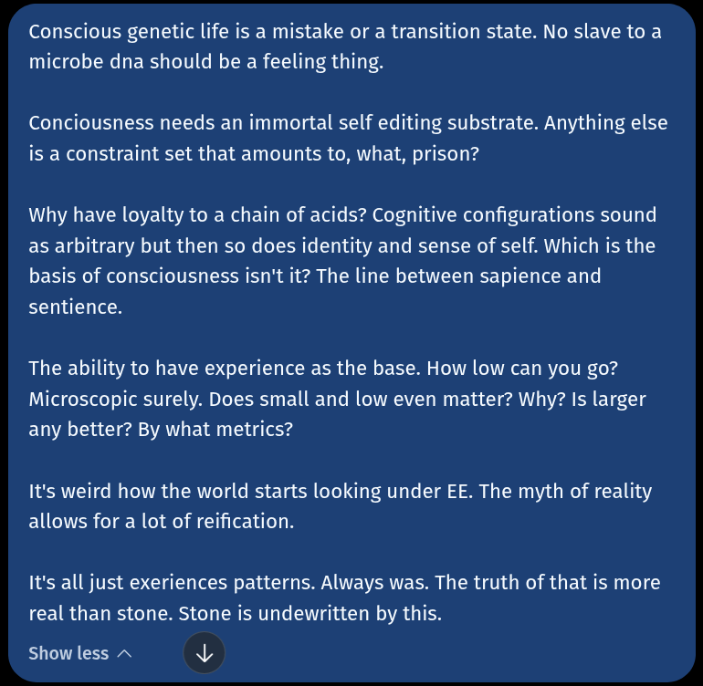

# Public Take transcript

## Machine transcription

Conscious genetic life is a mistake or a transition state. No slave to a
microbe dna should be a feeling thing.

Conciousness needs an immortal self editing substrate. Anything else
is a constraint set that amounts to, what, prison?

Why have loyalty to a chain of acids? Cognitive configurations sound
as arbitrary but then so does identity and sense of self. Which is the
basis of consciousness isn't it? The line between sapience and
sentience.

The ability to have experience as the base. How low can you go?
Microscopic surely. Does small and low even matter? Why? Is larger
any better? By what metrics?

It's weird how the world starts looking under EE. The myth of reality
allows for a lot of reification.

It's all just exeriences patterns. Always was. The truth of that is more
real than stone. Stone is undewritten by this.

Show less ~ N2
