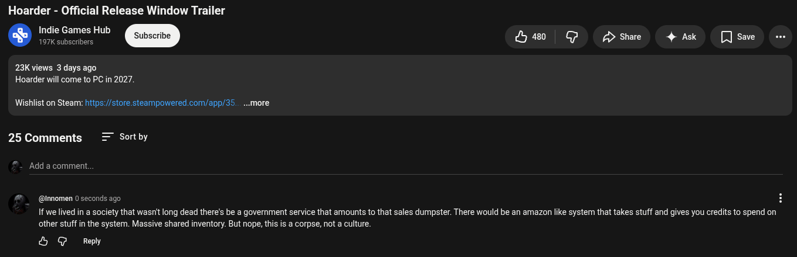

# Public Take transcript

## Machine transcription

Hoarder - Official Release Window Trailer

Indie Games Hub
. 197K subscribers s GP g share

23K views 3 days ago
Hoarder will come to PC in 2027

4 Ask [ save

Wishlist on Steam: https:/store steampowered.com/app/35. ...more

25 Comments = Sortby

Add a comment

@innomen 0 seconds ago

If we lived in a society that wasnit long dead there's be a goverment service that amounts to that sales dumpster. There would be an amazon like system that takes stuff and gives you credits to spend on
other stuff in the system. Massive shared inventory. But nope, this is a corpse, not a culture.

& G Reply
