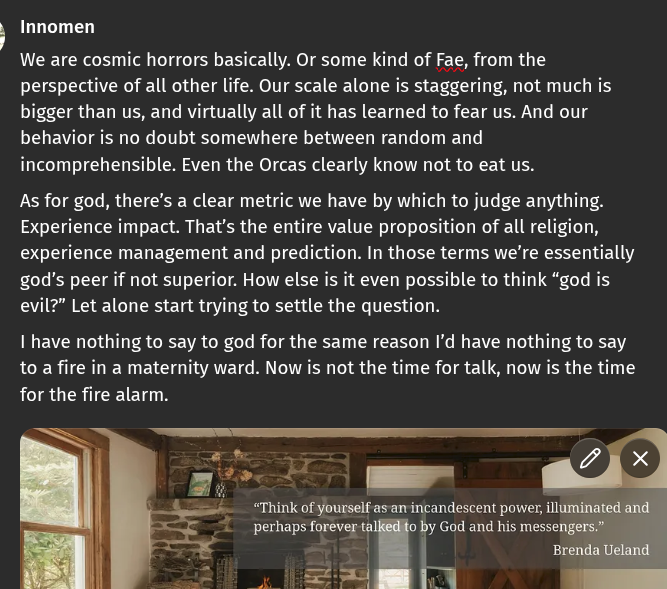

# Public Take transcript

## Machine transcription

} Innomen

We are cosmic horrors basically. Or some kind of Fae, from the
perspective of all other life. Our scale alone is staggering, not much is
bigger than us, and virtually all of it has learned to fear us. And our
behavior is no doubt somewhere between random and
incomprehensible. Even the Orcas clearly know not to eat us.

As for god, there’s a clear metric we have by which to judge anything.
Experience impact. That's the entire value proposition of all religion,
experience management and prediction. In those terms we're essentially
god's peer if not superior. How else is it even possible to think “god is
evil?” Let alone start trying to settle the question.

I have nothing to say to god for the same reason I'd have nothing to say
to a fire in a maternity ward. Now is not the time for talk, now is the time
for the fire alarm.
