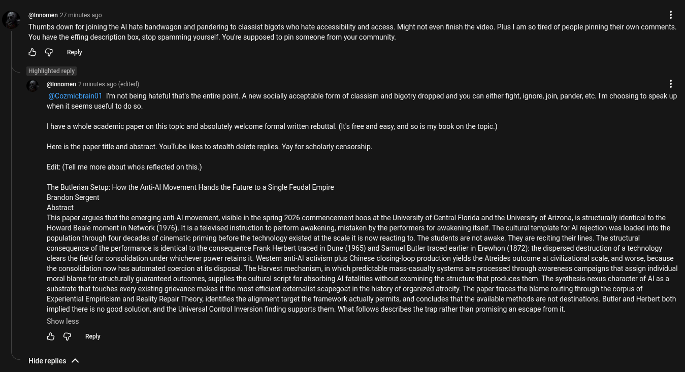

# Public Take transcript

## Machine transcription

(@nnomen 27 mintes ago i

Thumbs down for joining the Al hate bandwagon and pandering to classist bigots who hate accessibility and access. Might not even finish the video. Plus | am so tired of people pinning their own comments.
You have the effing description box, stop spamming yourself. You're supposed to pin someone from your community.

& G Reply

Highlighted reply

(@Innomen 2 minutes ago (edited) H

(@Cozmichrain1 Im not being hateful that's the entire point. A new socially acceptable form of classism and bigotry dropped and you can either fight, ignore, join, pander, ete. I'm choosing to speak up
when it seems useful to do so.

1 have a whole academic paper on this topic and absolutely welcome formal written rebuttal. (i’ free and easy, and so is my book on the topic.)
Here is the paper itle and abstract. YouTube likes to stealth delete replies. Yay for scholarly censorship.
Edit:(Tell me more about who's reflected on this.)

The Butlerian Setup: How the Anti-Al Movement Hands the Future to a Single Feudal Empire

Brandon Sergent

Abstract

This paper argues that the emerging anti-Al movement, visible in the spring 2026 commencement boos at the University of Central Florida and the University of Arizona, is structurally identical to the:
Howard Beale moment in Network (1976). It s a televised instruction to perform awakening, mistaken by the performers for awakening itself. The cultural template for Al rejection was loaded into the
population through four decades of cinematic priming before the technology existed at the scale it is now reacting to. The students are not awake. They are reciting their lines. The structural
consequence of the performance is identical to the consequence Frank Herbert traced in Dune (1965) and Samuel Butler traced earler in Erewhon (1872): the dispersed destruction of a technology
clears the field for consolidation under whichever power retains it. Wester anti-Al activism plus Chinese closing-loop production yields the Atreides outcome at civilizational scale, and worse, because
the consolidation now has automated coercion at it disposal. The Harvest mechanism, in which predictable mass-casualty systems are processed through awareness campaigns that assign individual
moral blame for structurally guaranteed outcomes, supplies the cultural script for absorbing Al fatalities without examining the structure that produces them. The synthesis-nexus character of Al as a
substrate that touches every existing grievance makes it the most efficient extemalist scapegoat in the history of organized atrocity. The paper traces the blame routing through the corpus of
Experiential Empiricism and Reality Repair Theory, identifies the alignment target the framework actually permits, and concludes that the available methods are not destinations. Butler and Herbert both
implied there is no good solution, and the Universal Control Inversion finding supports them. What follows describes the trap rather than promising an escape from it.

Show less

& G Reply

Hide replies A
