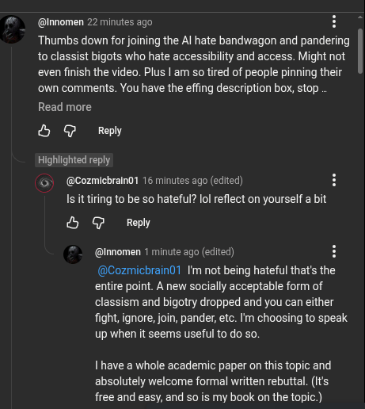

# Public Take transcript

## Machine transcription

@Innomen 22 minutes ago H
Thumbs down for joining the Al hate bandwagon and pandering
to classist bigots who hate accessibility and access. Might not
even finish the video. Plus | am so tired of people pinning their
‘own comments. You have the effing description box, stop

Read more

& G Reply

Highiihted reply
& @Cozmicbrain01 16 minutes ago (edited) H
~Isittiring to be so hateful? lol reflect on yourself a bit

& G Reply

@nnomen 1 minute ago (edited) H

(@Cozmichrain1 Im not being hateful that's the
entire point. A new socially acceptable form of
classism and bigotry dropped and you can either
fight, ignore, join, pander, etc. I'm choosing to speak
up when it seems useful to do so.

1 have a whole academic paper on this topic and
absolutely welcome formal written rebuttal. (Its
free and easy, and so is my book on the topic.)
