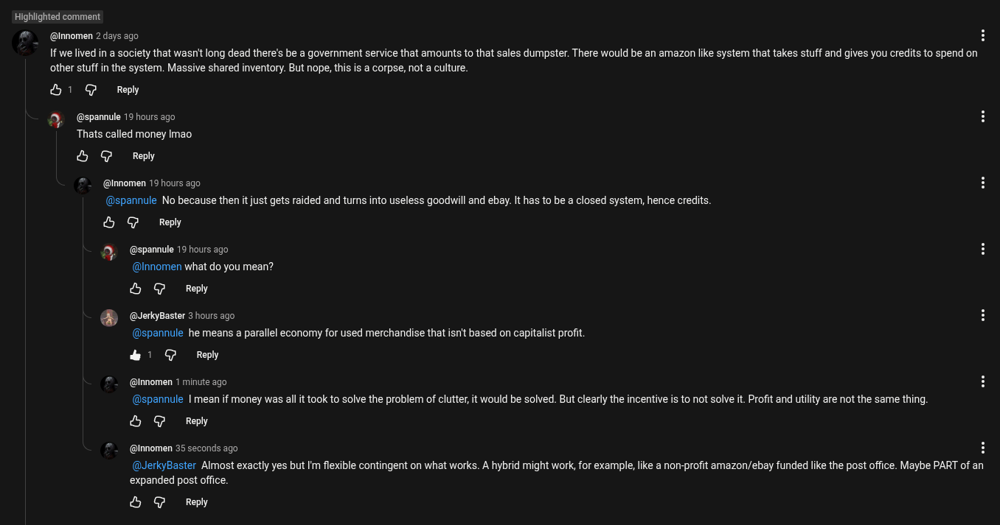

# Public Take transcript

## Machine transcription

Highlighted comment

@ @lnnomen 2 days ago
If we lived in a society that wasnit long dead there's be a goverment service that amounts to that sales dumpster. There would be an amazon like system that takes stuff and gives you credits to spend on
other stuff in the system. Massive shared inventory. But nope, this is a corpse, not a culture,

&1 @ Reply
@spannule 19 hours ago
Thats called money Imao
O @ Reply
@innomen 19 hours ago
(@spannule No because then it just gets raided and tums into useless goodwill and ebay. It has to be a closed system, hence credts.
O @ Reply
@spannule 19 hours ago
@Innomen what do you mean?
O @ Reply
‘t& (@JerkyBaster 3 hours ago

@spannule he means a parallel economy for used merchandise that isn't based on capitalist profit

&1 @ Reply

@innomen 1 minute ago
(@spannule | mean if money was all it took to solve the problem of clutter, it would be solved. But clearly the incentive is to not solve t. Profit and utiity are not the same thing.

& G Reply

(@lnnomen 35 seconds ago H
(@JerkyBaster Almost exactly yes but Im flexible contingent on what works. A hybrid might work, for example, like a non-profit amazon/ebay funded like the post office. Maybe PART of an
expanded post office.

& G Reply
