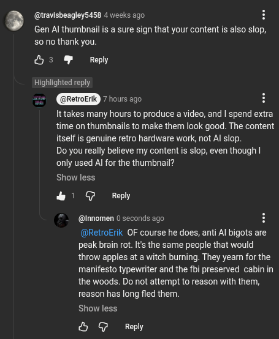

# Public Take transcript

## Machine transcription

(@travisbeagley5458 4 weeks ago H

Gen Al thumbnailis a sure sign that your content is also slop,
50 no thank you

&3 W Repy

Highlighted reply

= 7hours ago H

It takes many hours to produce a video, and | spend extra
time on thumbnails to make them look good. The content
itself is genuine retro hardware work, not Al slop.

Do you really believe my content i slop, even though |
only used Al for the thumbnail?

Show less.

& @ Reply

@innomen 0 seconds ago

(@RetroErik OF course he does, anti Al bigots are
peak brain rot. It the same people that would
throw apples at a witch bumning. They yearn for the
manifesto typewriter and the fbi preserved cabin in
the woods. Do not attempt to reason with them,
reason has long fled them.

Show less.

& G Reply
