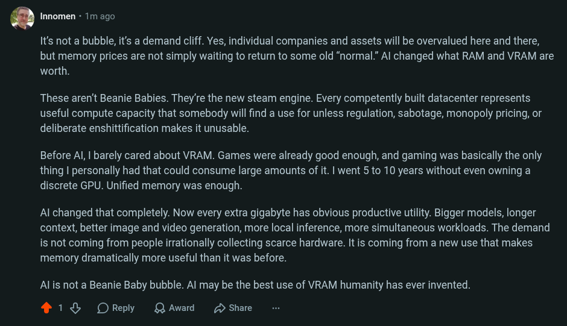

# Public Take transcript

## Machine transcription

. Innomen - 1m ago

It's not a bubble, it's a demand cliff. Yes, individual companies and assets will be overvalued here and there,
but memory prices are not simply waiting to return to some old “normal.” Al changed what RAM and VRAM are
worth.

These aren't Beanie Babies. They're the new steam engine. Every competently built datacenter represents
useful compute capacity that somebody will find a use for unless regulation, sabotage, monopoly pricing, or
deliberate enshittification makes it unusable.

Before Al, | barely cared about VRAM. Games were already good enough, and gaming was basically the only
thing | personally had that could consume large amounts of it. | went 5 to 10 years without even owning a
discrete GPU. Unified memory was enough.

Al changed that completely. Now every extra gigabyte has obvious productive utility. Bigger models, longer
context, better image and video generation, more local inference, more simultaneous workloads. The demand
is not coming from people irrationally collecting scarce hardware. It is coming from a new use that makes
memory dramatically more useful than it was before.

Al is not a Beanie Baby bubble. Al may be the best use of VRAM humanity has ever invented.

218 OReply QAwad 2 Share
