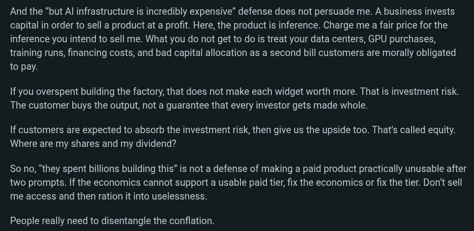

# Public Take transcript

## Machine transcription

And the “but Al infrastructure is incredibly expensive” defense does not persuade me. A business invests
capital in order to sell a product at a profit. Here, the product is inference. Charge me a fair price for the
inference you intend to sell me. What you do not get to do is treat your data centers, GPU purchases,
training runs, financing costs, and bad capital allocation as a second bill customers are morally obligated
to pay.

If you overspent building the factory, that does not make each widget worth more. That is investment risk.
The customer buys the output, not a guarantee that every investor gets made whole.

If customers are expected to absorb the investment risk, then give us the upside too. That's called equity.
Where are my shares and my dividend?

So no, “they spent billions building this” is not a defense of making a paid product practically unusable after
two prompts. If the economics cannot support a usable paid tier, fix the economics or fix the tier. Don't sell
me access and then ration it into uselessness.

People really need to disentangle the conflation.
