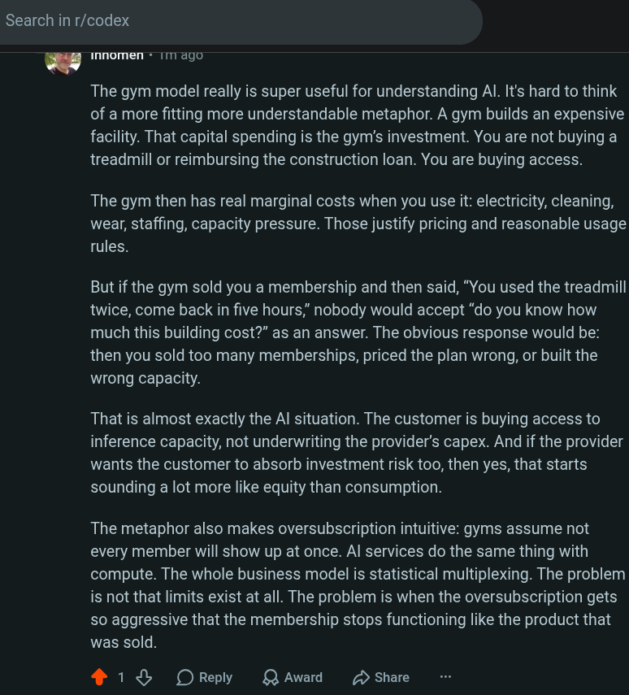

# Public Take transcript

## Machine transcription

Search in r/codex

_ Innomen + 1M ago

The gym model really is super useful for understanding Al. It's hard to think
of a more fitting more understandable metaphor. A gym builds an expensive
facility. That capital spending is the gym’s investment. You are not buying a
treadmill or reimbursing the construction loan. You are buying access.

The gym then has real marginal costs when you use it: electricity, cleaning,
wear, staffing, capacity pressure. Those justify pricing and reasonable usage
rules.

But if the gym sold you a membership and then said, “You used the treadmill
twice, come back in five hours,” nobody would accept “do you know how
much this building cost?” as an answer. The obvious response would be:
then you sold too many memberships, priced the plan wrong, or built the
wrong capacity.

That is almost exactly the Al situation. The customer is buying access to
inference capacity, not underwriting the provider's capex. And if the provider
wants the customer to absorb investment risk too, then yes, that starts
sounding a lot more like equity than consumption.

The metaphor also makes oversubscription intuitive: gyms assume not
every member will show up at once. Al services do the same thing with
compute. The whole business model is statistical multiplexing. The problem
is not that limits exist at all. The problem is when the oversubscription gets
so aggressive that the membership stops functioning like the product that
was sold.

413 OReply QAward D Share
