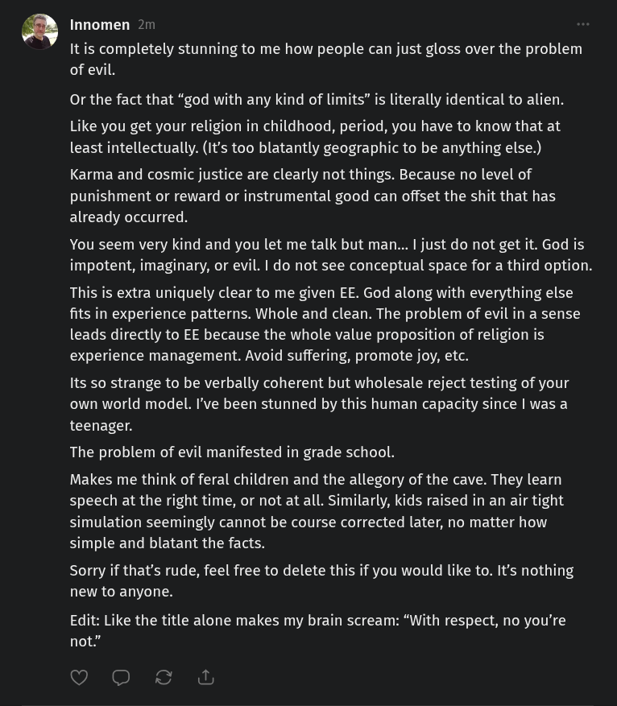

# Public Take transcript

## Machine transcription

E

Innomen 2rr

It is completely stunning to me how people can just gloss over the problem
of evil.

Or the fact that “god with any kind of limits” is literally identical to alien.

Like you get your religion in childhood, period, you have to know that at
least intellectually. (It's too blatantly geographic to be anything else.)

Karma and cosmic justice are clearly not things. Because no level of
punishment or reward or instrumental good can offset the shit that has
already occurred.

You seem very kind and you let me talk but man... | just do not get it. God is
impotent, imaginary, or evil. | do not see conceptual space for a third option.

This is extra uniquely clear to me given EE. God along with everything else
fits in experience patterns. Whole and clean. The problem of evil in a sense
leads directly to EE because the whole value proposition of religion is
experience management. Avoid suffering, promote joy, etc.

Its so strange to be verbally coherent but wholesale reject testing of your
own world model. I've been stunned by this human capacity since | was a
teenager.

The problem of evil manifested in grade school.

Makes me think of feral children and the allegory of the cave. They learn
speech at the right time, or not at all. Similarly, kids raised in an air tight
simulation seemingly cannot be course corrected later, no matter how
simple and blatant the facts.

Sorry if that's rude, feel free to delete this if you would like to. It's nothing
new to anyone.

Edit: Like the title alone makes my brain scream: “With respect, no you're
not.”
