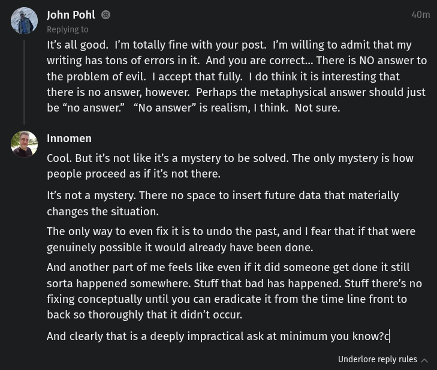

# Public Take transcript

## Machine transcription

John Pohl @ 40m
It's all good. I'm totally fine with your post. I'm willing to admit that my
writing has tons of errors in it. And you are correct... There is NO answer to
the problem of evil. 1accept that fully. | do think it is interesting that
there is no answer, however. Perhaps the metaphysical answer should just
be “no answer” “No answer” is realism, | think. Not sure.

Innomen

Cool. But it's not like it's a mystery to be solved. The only mystery is how
people proceed as if it's not there.

It's not a mystery. There no space to insert future data that materially
changes the situation.

The only way to even fix it is to undo the past, and | fear that if that were
genuinely possible it would already have been done.

And another part of me feels like even if it did someone get done it still
sorta happened somewhere. Stuff that bad has happened. Stuff there’s no
fixing conceptually until you can eradicate it from the time line front to
back so thoroughly that it didn’t occur.

And clearly that is a deeply impractical ask at minimum you know?d

Underlore reply rules
