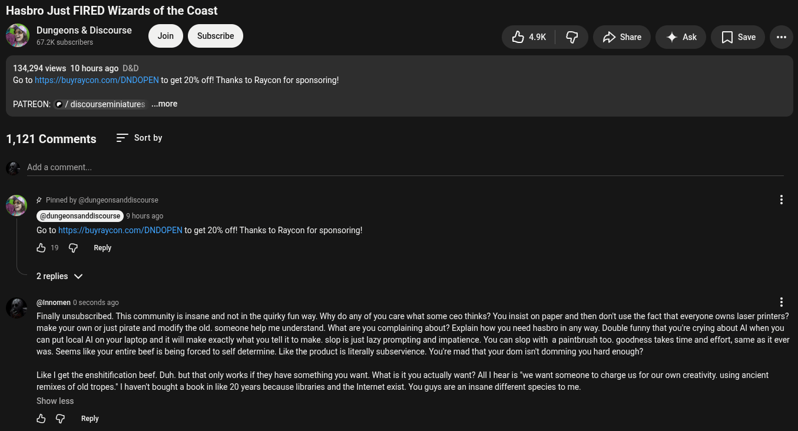

# Public Take transcript

## Machine transcription

Hasbro Just FIRED Wizards of the Coast

f Dungeons & Discourse
WS/ 7.2 subscribers

134,294 views 10 hours ago D&D
Goto htps:/buyraycon.com/DNDOPEN to get 20% offl Thanks to Raycon for sponsoring!

ibe Ak  Ga D share 4 Ak []Save e

PATREON: ¢ / discourseminiatures ...more

1,121 Comments = Sortby

Add a comment.

,@ # Pinned by @dungeonsanddiscourse

- nsanddiscourse JANSHEES)

Go to https:/buyraycon.com/DNDOPEN to get 20% offl Thanks to Raycon for sponsoring!
&9 @ Repy

2replies v

@innomen 0 seconds ago

Finally unsubscribed. This community is insane and not in the quirky fun way. Why do any of you care what some ceo thinks? You insist on paper and then donit use the fact that everyone owns laser printers?
make your own or just pirate and modify the old. someone help me understand. What are you complaining about? Explain how you need hasbro in any way. Double funny that you'e crying about Al when you
can put local Al on your laptop and it will make exactly what you tell it to make. slop is just lazy prompting and impatience. You can slop with a paintbrush too. goodness takes time and effort, same as it ever
was. Seems like your entire beef s being forced to self determine. Like the product s literally subservience. You'e mad that your dom isn't domming you hard enough?

Like | get the enshitification beef. Duh. but that only works if they have something you want. What s it you actually want? All | hear s “we want someone to charge us for our own creativity. using ancient
remixes of old tropes. | haven't bought  book in like 20 years because libraries and the Internet exist. You guys are an insane different species to me.

Show less.

& G Reply
