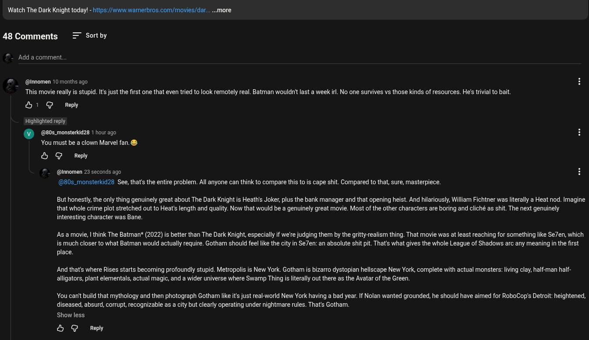

# Public Take transcript

## Machine transcription

Watch The Dark Knight today! - hitps:/www.warnerbros.com/movies/dar... ..more

48 Comments = Sortby

- Add a comment.

@ @nnomen 10 months ago
This movie really s stupid. It's just the first one that even tried to look remotely real. Batman wouldn't last a week irl. No one survives vs those kinds of resources. He's trivial to bait.

&1 @ Reply

Highlighted reply

@80s_monsterkid28 1 hour ago
You must be a clown Marvel fan. &

& G Reply

(@Innomen 23 seconds ago
(©80s_monsterkid28 See, that's the entire problem. All anyone can think to compare this to is cape shit. Compared to that, sure, masterpiece.

But honestly,the only thing genuinely great about The Dark Knight is Heath's Joker, plus the bank manager and that opening heist. And hilariously, William Fichtner was literally a Heat nod. Imagine
that whole crime plot stretched out to Heat's length and quality. Now that would be a genuinely great movie. Most of the other characters are boring and cliché as shit. The next genuinely
interesting character was Bane.

As amovie, | think The Batman* (2022) s better than The Dark Knight, especially if we'e judging them by the gritty-realism thing. That movie was at least reaching for something like Se7en, which
is much closer to what Batman would actually require. Gotham should feel like the city in Se7en: an absolute shit pit. That's what gives the whole League of Shadows arc any meaning in the first
place.

And that's where Rises starts becoming profoundly stupid. Metropolis is New York. Gotham is bizarro dystopian hellscape New York, complete with actual monsters: living clay, half-man haf-
alligators, plant elementals, actual magic, and a wider universe where Swamp Thingis literally out there as the Avatar of the Green.

You canit build that mythology and then photograph Gotham like it's just rea-world New York having a bad year. If Nolan wanted grounded, he should have aimed for RoboCop's Detroit: heightened,

diseased, absurd, corrupt, recognizable as a city but clearly operating under nightmare rules. That's Gotham.
Show less

& G Reply
