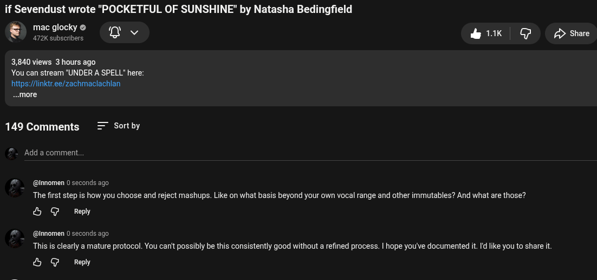

# Public Take transcript

## Machine transcription

if Sevendust wrote "POCKETFUL OF SUNSHINE" by Natasha Bedingfield

mac glocky © “m
v
fi 472K subscribers Q

&k G /> Share
3,840 views 3 hours ago
You can stream "UNDER A SPELL" here:

hitps://linkir.ee/zachmaclachlan
..more

149 Comments = Sortby
Add a comment

@innomen 0 seconds ago

The first step is how you choose and reject mashups. Like on what basis beyond your own vocal range and other immutables? And what are those?

& G Reply

@innomen 0 seconds ago

This is clearly a mature protocol. You can't possibly be this consistently good without a refined process. | hope you've documented it. I ike you to share it

& G Reply
