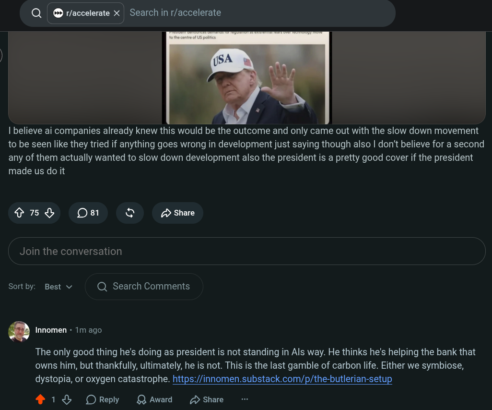

# Public Take transcript

## Machine transcription

Q | © raccelerate X | Search in r/accelerate

.

| believe ai companies already knew this would be the outcome and only came out with the slow down movement
to be seen like they tried if anything goes wrong in development just saying though also | don't believe for a second
any of them actually wanted to slow down development also the president is a pretty good cover if the president
made us do it

R Oe1 & £> Share

Join the conversation

Sortby: Best v Q Search Comments

* Innomen - 1m ago

The only good thing he's doing as president is not standing in Als way. He thinks he's helping the bank that
owns him, but thankfully, ultimately, he is not. This is the last gamble of carbon life. Either we symbiose,
dystopia, or oxygen catastrophe. https://innomen.substack.com/p/the-butlerian-setup

413 OReply QAwad D Share
