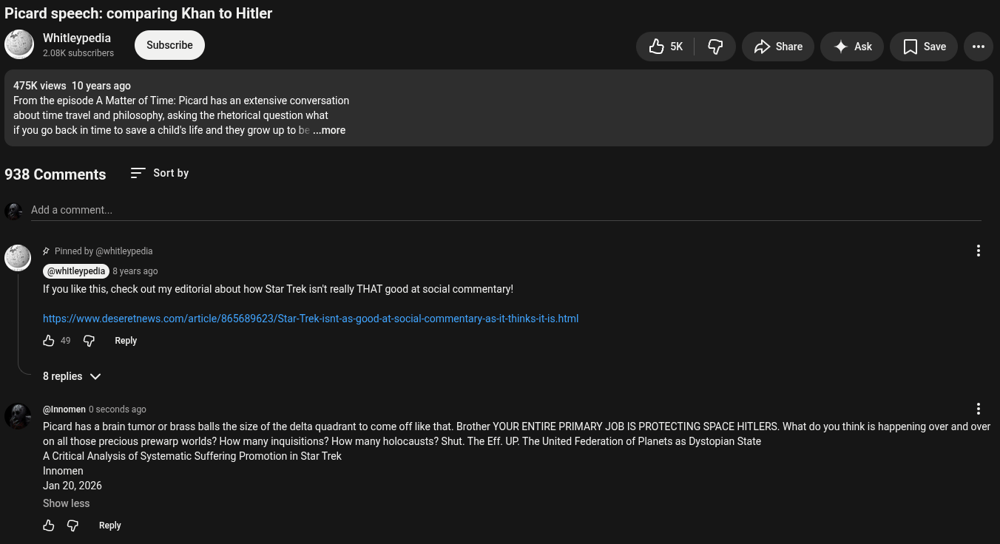

# Public Take transcript

## Machine transcription

Picard speech: comparing Khan to Hitler

Whitleypedia
2.08K subscribers

sk | G p>share 4 Ask  [] sawe

475K views 10 years ago

From the episode A Matter of Time: Picard has an extensive conversation
about time travel and philosophy, asking the rhetorical question what

if you go back in time to save a child's life and they grow up to be ...more

938 Comments = Sortby

Add a comment.

' # Pinned by @whitleypedia
@vhitleypedia ERCIERES
If you like this, check out my editorial about how Star Trek isn't really THAT good at social commentary!

hitps://www.deseretnews.com/article/865689623/Star-Trek-isnt-as-good-at-social-commentary-as-it-thinks-it-is.html

&9 G Repy
8replies v
@ @Innomen 0 seconds ago H

Picard has a brain tumor or brass balls the size of the delta quadrant to come of like that. Brother YOUR ENTIRE PRIMARY JOB IS PROTECTING SPACE HITLERS. What do you think is happening over and over
on all those precious prewarp worlds? How many inquisitions? How many holocausts? Shut. The Eff. UP. The United Federation of Planets as Dystopian State

ACritical Analysis of Systematic Suffering Promotion in Star Trek

Innomen

Jan 20,2026
Show less.

& G Reply
