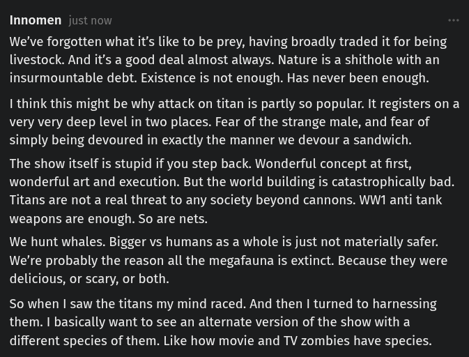

# Public Take transcript

## Machine transcription

Innomen just now

We've forgotten what it's like to be prey, having broadly traded it for being
livestock. And it's a good deal almost always. Nature is a shithole with an
insurmountable debt. Existence is not enough. Has never been enough.

I think this might be why attack on titan is partly so popular. It registers on a
very very deep level in two places. Fear of the strange male, and fear of
simply being devoured in exactly the manner we devour a sandwich.

The show itself is stupid if you step back. Wonderful concept at first,
wonderful art and execution. But the world building is catastrophically bad.
Titans are not a real threat to any society beyond cannons. WW1 anti tank
weapons are enough. So are nets.

We hunt whales. Bigger vs humans as a whole is just not materially safer.
We're probably the reason all the megafauna is extinct. Because they were
delicious, or scary, or both.

So when | saw the titans my mind raced. And then | turned to harnessing
them. | basically want to see an alternate version of the show with a
different species of them. Like how movie and TV zombies have species.
