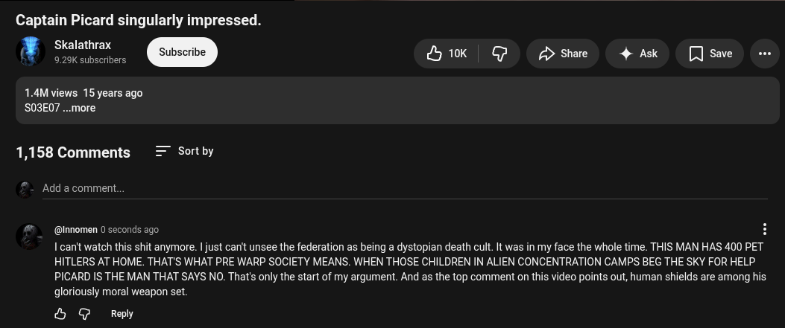

# Public Take transcript

## Machine transcription

Captain Picard singularly impressed.

Skalathrax
929 subscrbers &k | GF o p>shae 4 Ak [Jsae o

1.4M views 15 years ago
SO3E07 ..more.

1,158 Comments Sort by

Add a comment.

(@Innomen 0 seconds ago H
I can't watch this shit anymore. | just can't unsee the federation as being a dystopian death cult. t was in my face the whole time. THIS MAN HAS 400 PET
HITLERS AT HOME. THAT'S WHAT PRE WARP SOCIETY MEANS. WHEN THOSE CHILDREN IN ALIEN CONCENTRATION CAMPS BEG THE SKY FOR HELP

PICARD IS THE MAN THAT SAYS NO. That's only the start of my argument. And as the top comment on this video points out, human shields are among his
gloriously moral weapon set.

& G Reply
