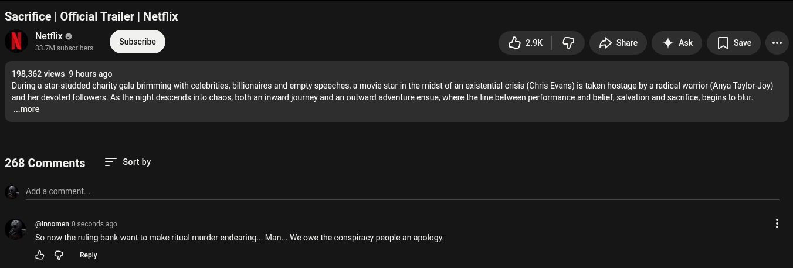

# Public Take transcript

## Machine transcription

Sacrifice | Official Trailer | Netflix

Netflix ©
33.7M subscribers 29k G p>share 4 Ak []Sae e

198,362 views 9 hours ago

During a star-studded charity gala brimming with celebrites, billionaires and empty speeches, a movie star in the midst of an existential crisis (Chris Evans) is taken hostage by a radical warrior (Anya Taylor-Joy)

and her devoted followers. As the night descends into chaos, both an inward journey and an outward adventure ensue, where the line between performance and belief, salvation and sacrifice, begins to blur.
..more

268 Comments Sort by

Add a comment.

@innomen 0 seconds ago

So now the ruling bank want to make ritual murder endearing... Man... We owe the conspiracy people an apology.

& G Reply
