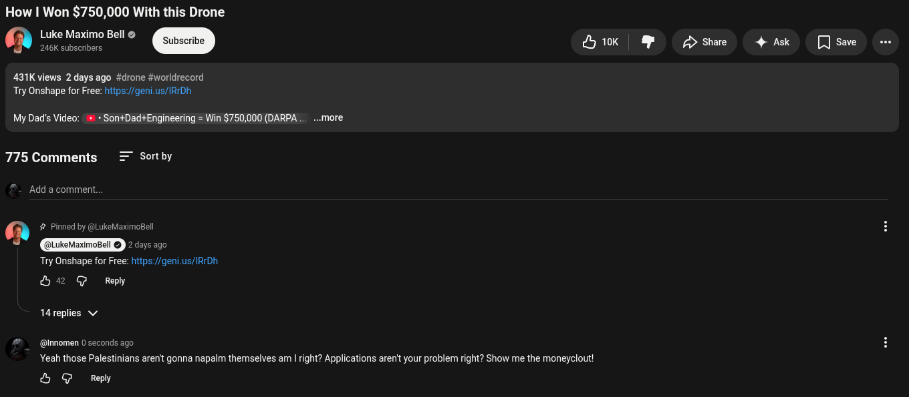

# Public Take transcript

## Machine transcription

How | Won $750,000 With this Drone
@ Luke Maximo Bell
246K subscribers

431K views 2 days ago #drone #worldrecord
Try Onshape for Free: hips:/gen.us/IRrDh

My Dad's Video: » + Son+Dad+Engineering = Win $750,000 (DARPA

775 Comments = Sortby

Add a comment.

@ # Pimedby

Try Onshape for Free: htips:/geni.us/IRrDh
&2 G Reply

keMaximoBell

2days ago

14 replies v/

@ @nnomen 0 seconds ago

..more

7y 10k

Yeah those Palestinians arent gonna napalm themselves am | right? Applications aren' your problem right? Show me the moneyclout!

& G Reply

L /> Share

4 Ask

[ save
