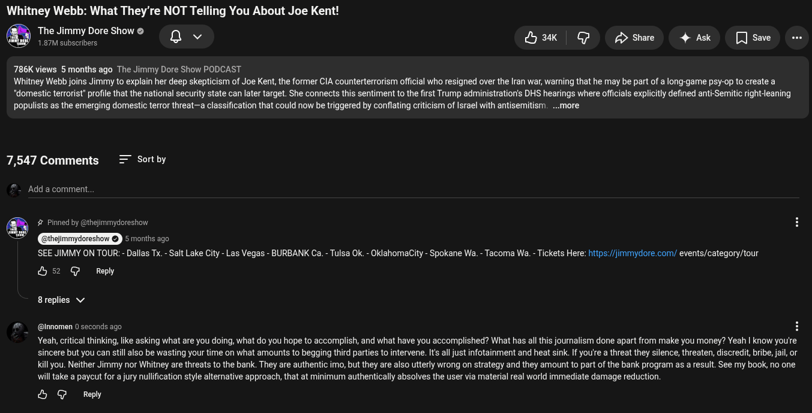

# Public Take transcript

## Machine transcription

Whitney Webb: What They’re NOT Telling You About Joe Kent!

The Jimmy Dore Show
1.87M subscribers Qv Hak G /> Share 4 Ask [Jsave -

786K views 5 months ago The Jimmy Dore Show PODCAST
Whitney Webb joins Jimmy to explain her deep skepticism of Joe Kent, the former CIA counterterrorism official who resigned over the Iran war, warning that he may be part of a long-game psy-op to create a
*domestic terrorist’ profile that the national security state can later target. She connects this sentiment to the first Trump administratioris DHS hearings where offcials explicitly defined anti-Semitic right-leaning

populists as the emerging domestic terror threat—a classification that could now be triggered by conflating criticism of Israel with antisemitism. ..more

7,547 Comments = Sortby

Add a comment.

thejimmydoreshow

5months ago
SEE JIMMY ON TOUR: - Dallas Tx.- Salt Lake City - Las Vegas - BURBANK Ca. - Tulsa Ok. - OklahomaCity - Spokane Wa. - Tacoma Wa. - Tickets Here: htips:/jmmydore.com/ events/category/tour

b2 @ Ry

8replies v

- (@Innomen 0 seconds ago
Yeah, critical thinking, like asking what are you doing, what do you hope to accomplish, and what have you accomplished? What has all this journalism done apart from make you money? Yeah | know you'e
sincere but you can still also be wasting your time on what amounts to begging third parties to intervene. Its all just infotainment and heat sink. If you'e a threat they silence, threaten, discredit, bribe, jail, or
Kill you. Neither Jimmy nor Whitney are threats to the bank. They are authentic imo, but they are also utterly wrong on strategy and they amount to part of the bank program as a result. See my book, no one
will take a paycut for a jury nullification style altemative approach, that at minimum authentically absolves the user via material real world immediate damage reduction.

& G Reply
