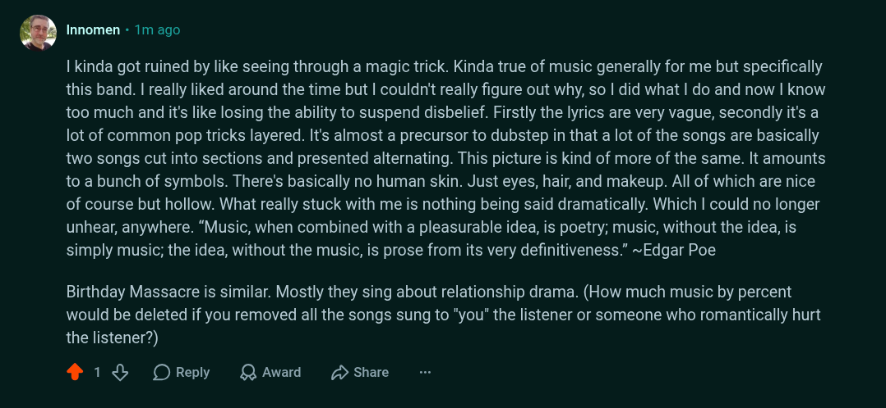

# Public Take transcript

## Machine transcription

' Innomen - 1m ago

I kinda got ruined by like seeing through a magic trick. Kinda true of music generally for me but specifically
this band. | really liked around the time but | couldn't really figure out why, so | did what | do and now | know
too much and it's like losing the ability to suspend disbelief. Firstly the lyrics are very vague, secondly it's a
lot of common pop tricks layered. It's almost a precursor to dubstep in that a lot of the songs are basically
two songs cut into sections and presented alternating. This picture is kind of more of the same. It amounts
to a bunch of symbols. There's basically no human skin. Just eyes, hair, and makeup. All of which are nice
of course but hollow. What really stuck with me is nothing being said dramatically. Which | could no longer
unhear, anywhere. “Music, when combined with a pleasurable idea, is poetry; music, without the idea, is
simply music; the idea, without the music, is prose from its very definitiveness.” ~Edgar Poe

Birthday Massacre is similar. Mostly they sing about relationship drama. (How much music by percent
would be deleted if you removed all the songs sung to "you" the listener or someone who romantically hurt
the listener?)

413 OReply QAwad D Share
