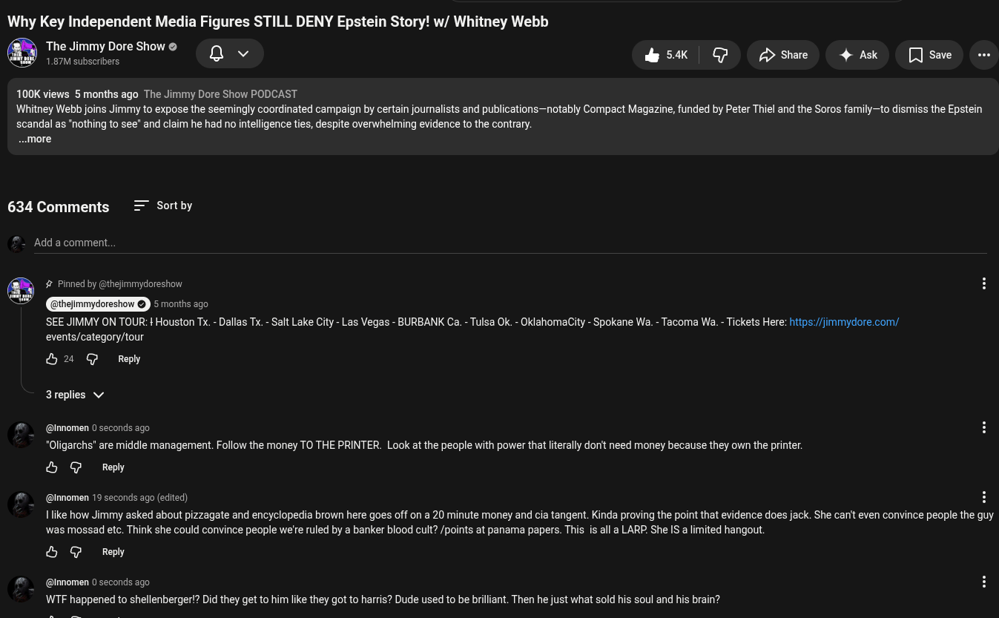

# Public Take transcript

## Machine transcription

Why Key Independent Media Figures STILL DENY Epstein Story! w/ Whitney Webb

The Jimmy Dore Show &
1.67M subscrbers Q v &5k | @ Dswre  4Ak [Jsae o

100K views 5 months ago The Jimmy Dore Show PODCAST
Whitney Webb joins Jimmy to expose the seemingly coordinated campaign by certain journalists and publications—notably Compact Magazine, funded by Peter Thiel and the Soros family—to dismiss the Epstein
scandal as "nothing to see” and claim he had no intelligence ties, despite overwhelming evidence to the contrary.

..more

634 Comments = Sortby

Add a comment.

SEE JIMMY ON TOUR: + Houston Tx. - Dallas Tx. - Salt Lake City - Las Vegas - BURBANK Ca. - Tulsa Ok. - OklahomaCity - Spokane Wa. - Tacoma Wa. - Tickets Here: https://jimmydore.com/

events/category/tour
&2 @ Repy
Ireplies v

@ @Innomen 0 seconds ago
*Oligarchs" are middle management. Follow the money TO THE PRINTER. Look at the people with power that iterally donit need money because they own the printer.

& G Reply

@ @innomen 19 seconds ago (edited) H
Ilike how Jimmy asked about pizzagate and encyclopedia brown here goes off on a 20 minute money and cia tangent. Kinda proving the point that evidence does jack. She can't even convince people the guy
was mossad etc. Think she could convince people we're ruled by a banker blood cult? /points at panama papers. This is all a LARP. She IS a limited hangout

& G Reply

@ @Innomen 0 seconds ago
WTF happened to shellenberger!? Did they get to him like they got to harris? Dude used to be brilliant. Then he just what sold his soul and his brain?
