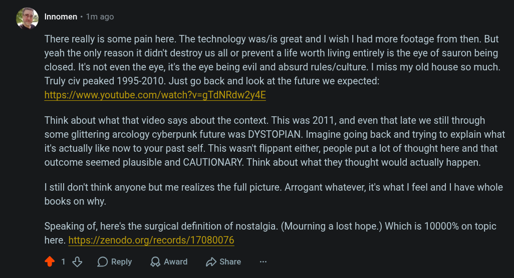

# Public Take transcript

## Machine transcription

‘ Innomen - 1m ago

There really is some pain here. The technology was/is great and | wish | had more footage from then. But
yeah the only reason it didn't destroy us all or prevent a life worth living entirely is the eye of sauron being
closed. It's not even the eye, it's the eye being evil and absurd rules/culture. I miss my old house so much.
Truly civ peaked 1995-2010. Just go back and look at the future we expected:
https:/www.youtube.com/watch?v=gTdNRdw2y4E

Think about what that video says about the context. This was 2011, and even that late we still through
some glittering arcology cyberpunk future was DYSTOPIAN. Imagine going back and trying to explain what
it's actually like now to your past self. This wasn't flippant either, people put a lot of thought here and that
outcome seemed plausible and CAUTIONARY. Think about what they thought would actually happen.

| still don't think anyone but me realizes the full picture. Arrogant whatever, it's what | feel and | have whole
books on why.

Speaking of, here's the surgical definition of nostalgia. (Mourning a lost hope.) Which is 10000% on topic
here. https://zenodo.org/records/17080076

418 OReply QAward D Share
