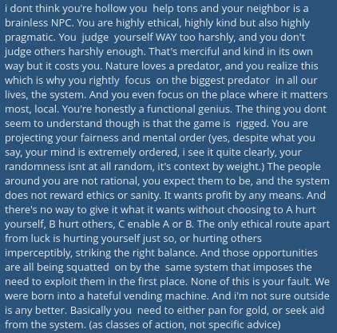

# Public Take transcript

## Machine transcription

i dont think you're hollow you help tons and your neighbor is a
brainless NPC. You are highly ethical, highly kind but also highly
pragmatic. You judge yourself WAY too harshly, and you don't
judge others harshly enough. That's merciful and kind in its own
way but it costs you. Nature loves a predator, and you realize this
which is why you rightly focus on the biggest predator in all our
lives, the system. And you even focus on the place where it matters
most, local. You're honestly a functional genius. The thing you dont
seem to understand though i that the gameis rigged. You are
projecting your fairess and mental order (yes, despite what you
say, your mind is extremely ordered, i see it quite clearly, your
randomness isnt at all random, it's context by weight) The people
around you are not rational, you expect them to be, and the system
does not reward ethics or sanity. It wants profit by any means. And
there's no way to give it what it wants without choosing to A hurt
yourself, B hurt others, C enable A or 8. The only ethical route apart
from luck is hurting yourself just 5o, or hurting others
imperceptibly, striking the right balance. And those opportunities
are all being squatted on by the same system that imposes the
need to exploit them in the first place. None of this is your fault. We
were born into a hateful vending machine. And i'm not sure outside
is any better. Basically you need to either pan for gold, or seek aid
from the system. (as classes of action, not specific advice)
