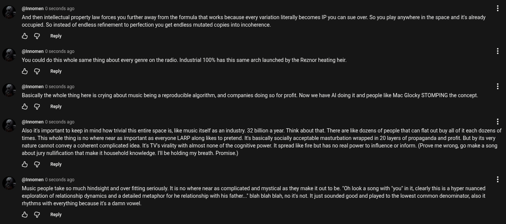

# Public Take transcript

## Machine transcription

@lnnomen 0 seconds ago
And then intellectual property law forces you further away from the formula that works because every variation literally becomes IP you can sue over. So you play anywhere in the space and it already
oceupied. So instead of endless refinement to perfection you get endless mutated copies into incoherence.

& G Reply

@innomen 0 seconds ago
You could do this whole same thing about every genre on the radio. Industrial 100% has this same arch launched by the Reznor heating heir

& G Reply

@lnnomen 0 seconds ago
Basically the whole thing here is crying about music being a reproducible algorithm, and companies doing so for profit. Now we have Al doing it and people like Mac Glocky STOMPING the concept.

& G Reply

(@Innomen 0 seconds ago H
Alsoit's important to keep in mind how trivial this entire space i, like music itself as an industry. 32 billion a year. Think about that. There are lie dozens of people that can flat out buy all of it each dozens of
times. This whole thing is no where near as important as everyone LARP along likes to pretend. Its basically sacially acceptable masturbation wrapped in 20 layers of propaganda and profit. But by ts very
nature cannot convey a coherent complicated idea. Its TV's virality with almost none of the cognitive power. It spread like fire but has no real power to influence or inform. (Prove me wrong, go make a song
about jury nullfication that make it household knowledge. Il be holding my breath. Promise.)

& G Reply

@innomen 0 seconds ago

Music people take so much hindsight and over fitting seriously. It is no where near as complicated and mystical as they make it out to be. “Oh look a song with "you' in it clearly this is a hyper nuanced
exploration of relationship dynamics and a detailed metaphor for he relationship with his father..” blah biah blah, no it not. It just sounded good and played to the lowest common denominator, also it
thythms with everything because it's a damn vowel.

& G Reply
