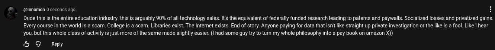

# Public Take transcript

## Machine transcription

@innomen 0 seconds ago H

Dude this is the entire education industry. this is arguably 90% of all technology sales. s the equivalent of federally funded research leading to patents and paywalls. Socialized losses and privatized gains.
Every course in the world is a scam. College is a scam. Libraries exist. The Internet exists. End of story. Anyone paying for data that isn' like straight up private investigation or the like is a fool. Like | hear
you, but this whole class of activity s just more of the same made slightly easier. (1 had some guy try to tum my whole philosophy into a pay book on amazon X))

&L @ Reply
