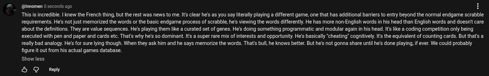

# Public Take transcript

## Machine transcription

@innomen 0 seconds ago

This is incredible. | knew the French thing, but the rest was news to me. It clear he's as you say literally playing a different game, one that has additional barriers to entry beyond the normal endgame scrabble
requirements. He's not just memorized the words or the basic endgame process of scrabble, he's viewing the words differently. He has more non-English words in his head than English words and doesn't care
about the definitions. They are value sequences. He's playing them like a curated set of genes. He's doing something programmatic and modular again in his head. Its like a coding competition only being

executed with pen and paper and cards etc. That's why he's so dominant. Its a super rare mix of interests and opportunity. He's basically *cheating” cognitively. It the equivalent of counting cards. But that's a

really bad analogy. He's for sure lying though. When they ask him and he says memorize the words. Thats bull, he knows better. But he's not gonna share until he's done playing, if ever. We could probably
figure it out from his actual games database.

Show less.

& G Reply
