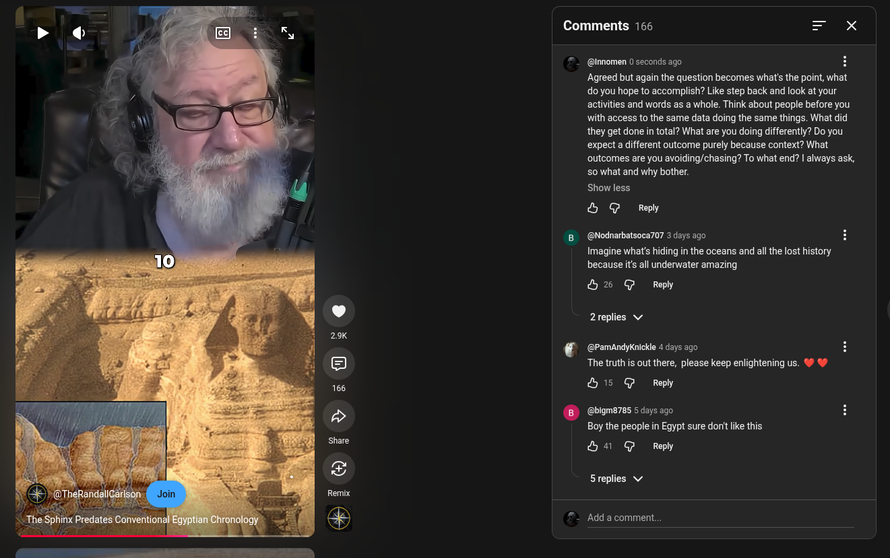

# Public Take transcript

## Machine transcription

Comments 166

~_ @Innomen 0 seconds ago H

Agreed but again the question becomes what's the point, what
do you hope to accomplish? Like step back and look at your
activities and words as a whole. Think about people before you
with access to the same data doing the same things. What did
they get done i total? What are you doing differently? Do you
expect a different outcome purely because context? What
outcomes are you avoiding/chasing? To what end? | always ask,
50 what and why bother.

Show less

& G Reply

B @Nodnarbatsoca707 3 deys ago

Imagine what's hiding in the oceans and all the lost history
because its all underwater amazing

Hs @ ey

2replies v

’ (@PamAndyKnickle 4 days ago
The truth is out there, please keep enlightening us. % %

&5 @ ey

. (@bigm8785 5 days ago
Boy the people in Eqypt sure donit like this

Lo @ ey

Sreplies v

£ Addacomment..
