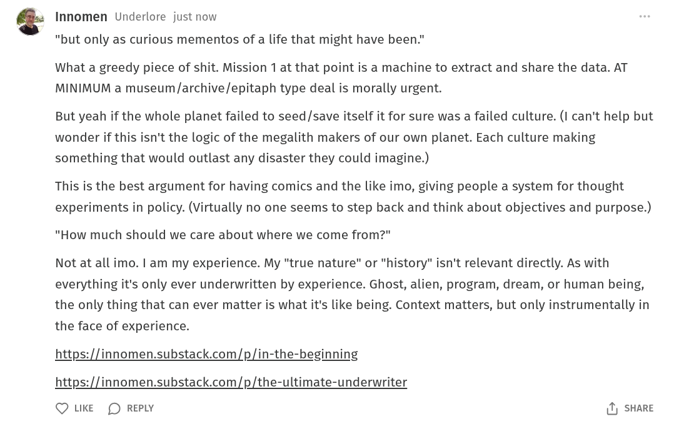

# Public Take transcript

## Machine transcription

Innomen Underlore just now

"but only as curious mementos of a life that might have been."

What a greedy piece of shit. Mission 1 at that point is a machine to extract and share the data. AT
MINIMUM a museum/archive/epitaph type deal is morally urgent.

But yeah if the whole planet failed to seed/save itself it for sure was a failed culture. (I can't help but
wonder if this isn't the logic of the megalith makers of our own planet. Each culture making
something that would outlast any disaster they could imagine.)

This is the best argument for having comics and the like imo, giving people a system for thought
experiments in policy. (Virtually no one seems to step back and think about objectives and purpose.)

"How much should we care about where we come from?"

Not at all imo. I am my experience. My "true nature" or "history" isn't relevant directly. As with
everything it's only ever underwritten by experience. Ghost, alien, program, dream, or human being,
the only thing that can ever matter is what it's like being. Context matters, but only instrumentally in
the face of experience.

https://innomen.substack.com/p/in-the-beginning

https://innomen.substack.com/p/the-ultimate-underwriter

Q LKE (D REPLY 1) SHARE
