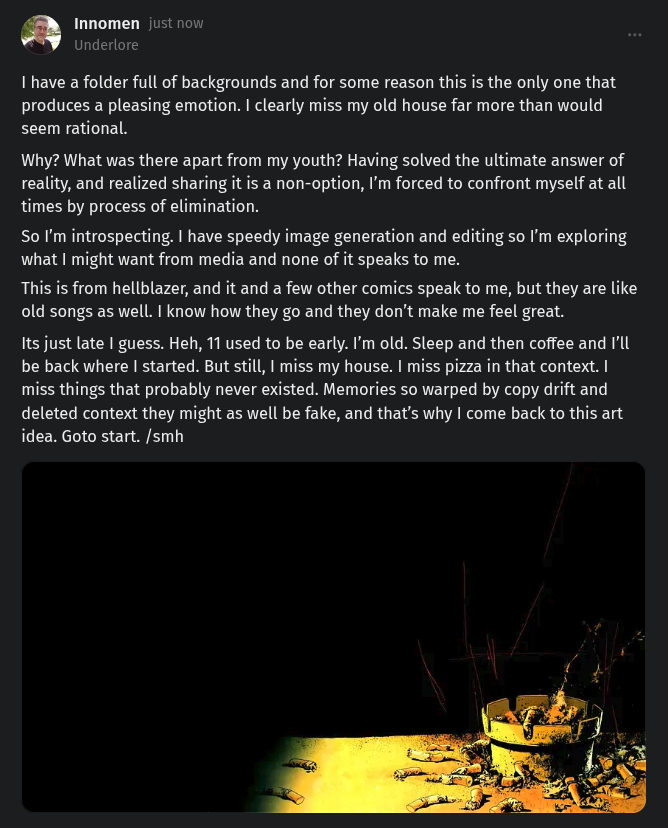

# Public Take transcript

## Machine transcription

fi Innomen just nov
Underlore

1 have a folder full of backgrounds and for some reason this is the only one that
produces a pleasing emotion. | clearly miss my old house far more than would
seem rational.

Why? What was there apart from my youth? Having solved the ultimate answer of
reality, and realized sharing it is a non-option, I'm forced to confront myself at all
times by process of elimination.

So I'm introspecting. | have speedy image generation and editing so I'm exploring
what | might want from media and none of it speaks to me.

This is from hellblazer, and it and a few other comics speak to me, but they are like
old songs as well. | know how they go and they don’t make me feel great.

Its just late | guess. Heh, 11 used to be early. 'm old. Sleep and then coffee and Ill
be back where | started. But still, | miss my house. | miss pizza in that context. |
miss things that probably never existed. Memories so warped by copy drift and
deleted context they might as well be fake, and that's why | come back to this art
idea. Goto start. /smh
