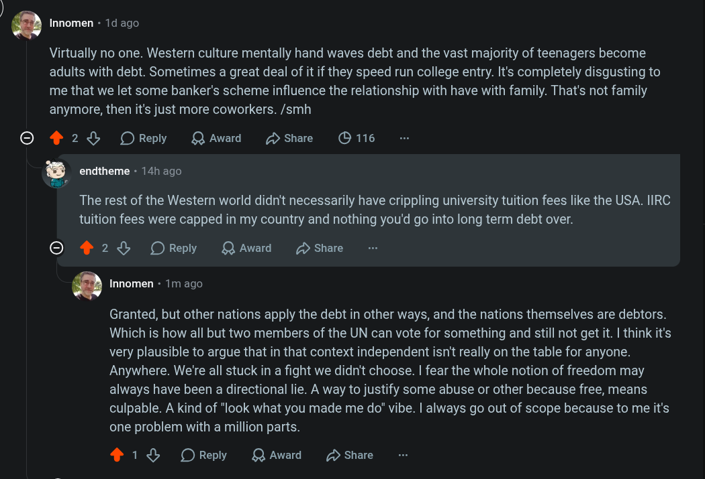

# Public Take transcript

## Machine transcription

‘ Innomen - 1d ago

Virtually no one. Western culture mentally hand waves debt and the vast majority of teenagers become
adults with debt. Sometimes a great deal of it if they speed run college entry. It's completely disgusting to
me that we let some banker's scheme influence the relationship with have with family. That's not family
anymore, then it's just more coworkers. /smh

O 428 OReply QAward Hshae O 116

Q endtheme - 14h ago

The rest of the Western world didn't necessarily have crippling university tuition fees like the USA. IIRC
tuition fees were capped in my country and nothing you'd go into long term debt over.

O 2L OReply QAward 2 Share

‘ Innomen - 1m ago

Granted, but other nations apply the debt in other ways, and the nations themselves are debtors.
Which is how all but two members of the UN can vote for something and still not get it. | think it's
very plausible to argue that in that context independent isn't really on the table for anyone.
Anywhere. We're all stuck in a fight we didn't choose. | fear the whole notion of freedom may
always have been a directional lie. A way to justify some abuse or other because free, means
culpable. A kind of "look what you made me do" vibe. | always go out of scope because to me it's
one problem with a million parts.

4 18% OReply QAward D Share
