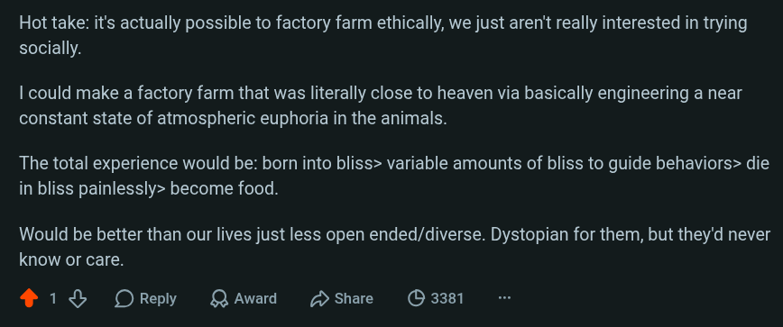

# Public Take transcript

## Machine transcription

Hot take: it's actually possible to factory farm ethically, we just aren't really interested in trying
socially.

| could make a factory farm that was literally close to heaven via basically engineering a near
constant state of atmospheric euphoria in the animals.

The total experience would be: born into bliss> variable amounts of bliss to guide behaviors> die
in bliss painlessly> become food.

Would be better than our lives just less open ended/diverse. Dystopian for them, but they'd never
know or care.

418 OReply QAward share (D 3381
