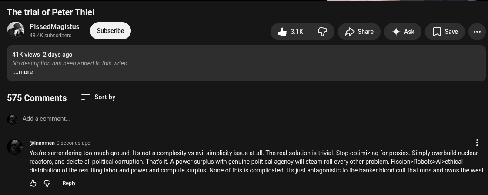

# Public Take transcript

## Machine transcription

The trial of Peter Thiel

PissedMagistus
48.4K subscribers.

&3k G /> Share 4 Ask [ save

41K views 2 days ago

No description has been added to this video.
..more

575 Comments = Sortby

Add a comment.

@innomen 0 seconds ago

Youtre surrendering too much ground. Its not a complexity vs evil simplicity issue at all. The real solution is rivial. Stop optimizing for proxies. Simply overbuild nuclear
reactors, and delete all political corruption. That's it. A power surplus with genuine political agency will steam roll every other problem. Fission>Robots>Al>ethical
distribution of the resulting labor and power and compute surplus. None of this is complicated. It just antagonistic to the banker blood cult that runs and owns the west.

& G Reply
