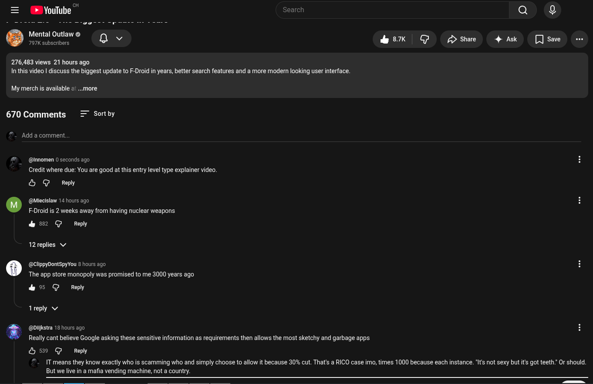

# Public Take transcript

## Machine transcription

©

= % Youlube Sea Q

Mental Outlaw ©
’ 797K subscrbers Q v &K | @ Dstre 4 Ak []sme

276,483 views 21 hours ago
Inthis video | discuss the biggest update to F-Droid in years, better search features and a more modern looking user interface.

My merch is available & ...more

670 Comments = Sortby

Add a comment.

@ @nnomen 0 seconds ago

Credit where due: You are good at this entry level type explainer video.

& G Reply

‘ (@Miecislaw 14 hours ago
F-Droid s 2 weeks away from having nuclear weapons

&2 @ Reply

12 replies v/

° (@ClippyDontSpyYou 8 hours ago
The app store monopoly was promised to me 3000 years ago
& 5 @ Reply
reply v

@Dikstra 18 hours ago

Really cant believe Google asking these sensitive information as requirements then allows the most sketchy and garbage apps

&5 @ Repy

IT means they know exactly who is scamming who and simply choose to allow it because 30% cut. That's a RICO case imo, times 1000 because each instance. *Its not sexy but it got teeth Or should
But we live in a mafia vending machine, not a country.
