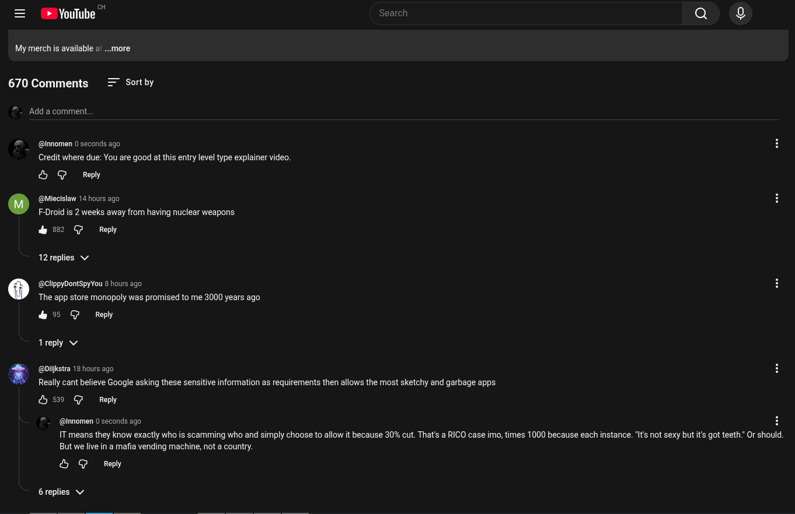

# Public Take transcript

## Machine transcription

cH
= (» YouTube Search aQa ¢
My merchis available & ..more
670 Comments Sort by
. Add acomment.
#  @innomen 0 seconds ago H
Credit where due: You are good at this entry level type explainer video.
O @ Reply
. (@Miecislaw 14 hours ago H
F-Droid s 2 weeks away from having nuclear weapons
& 552 @ Reply
12 replies v
° (@ClippyDontSpyYou 8 hours ago H
The app store monopoly was promised to me 3000 years ago
&5 @ Reply
reply v
@ (@Dlijkstra 18 hours ago H
Really cant believe Google asking these sensitive information as requirements then allows the most sketchy and garbage apps.
&9 @ Reply
~_ @innomen 0 seconds ago H

IT means they know exactly who is scamming who and simply choose to allow it because 30% cut. That's a RICO case imo, times 1000 because each instance. *Its not sexy but it got teeth Or should
But we live in a mafia vending machine, not a country.

& G Reply

6 replies v
